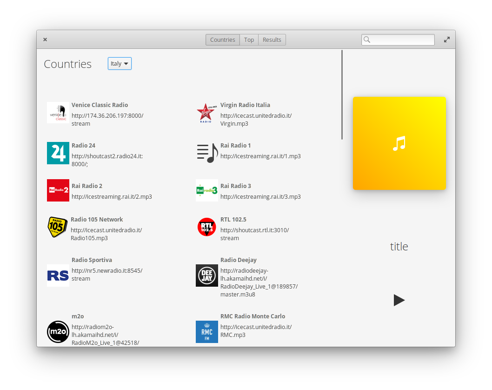
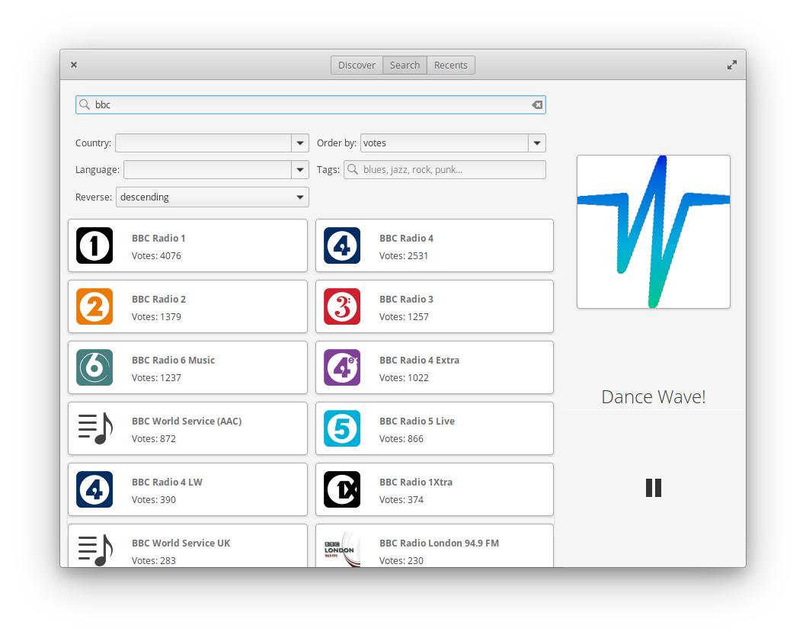

# Raddiu




this is a radio program made for GNU/Linux (especially elementary os).

# Cli usage
```bash
com.github.ranfdev.raddiu search $radio_name --country $country_name --order $reverse --state $state --language $language
```
# TODO:

- remove country page
- create a new discover page:

    The discover page should be a more user friendly search page, with coloured buttons and nice
    images.

    the page should contain some buttons with genres.
    when the user clicks on a genre, the ui switches to the search page and starts
    searching for the correct genre.

- add more options to the cli.

# Development
clone the repo and install the dependencies (You can find the list of dependencies in the meson.build file).
You also need to install the elementary os sdk "elementary-sdk"

# Build
````
meson build
cd build
ninja install
````

To do subsequent builds you can just run ```ninja``` and then run the program by doing ```./com.github.ranfdev.raddiu```
